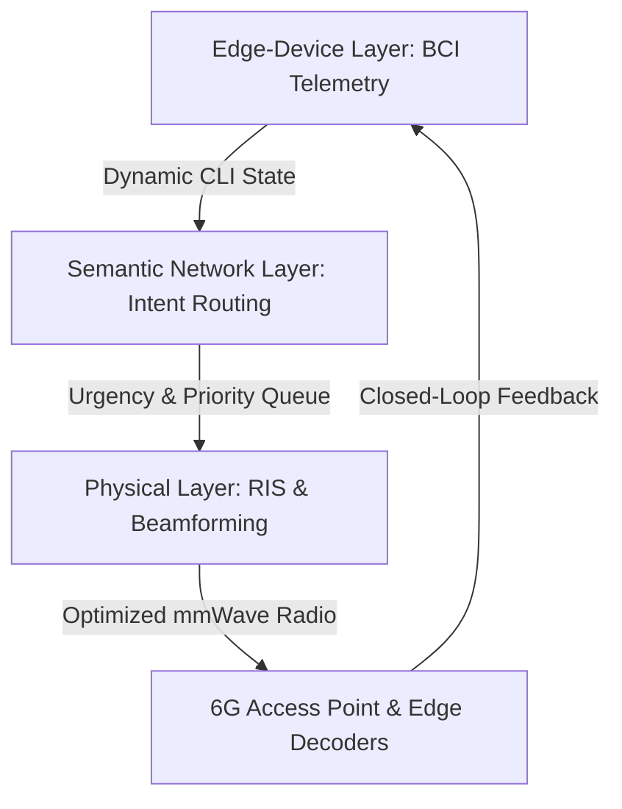

# COGN-NDAN: A Semantic-Aware Cross-Layer Protocol with Neural Feedback Integration for Neuro-Symbiotic 6G Networks

[](https://opensource.org/licenses/MIT)
[](https://github.com/FernandoMay/cogn-ndan)
[](https://github.com/FernandoMay/cogn-ndan)

This repository contains the official paper draft and an interactive visual simulation suite for **COGN-NDAN (Cognitive Orchestration & Green Networking - NeuroDigital Adaptive Network)**, a novel cross-layer protocol designed to unify cognitive biotelemetry (BCI) feedback loops with next-generation 6G Physical, Network, and Edge Intelligence systems.

---

## 🌟 Key Features & Architecture

COGN-NDAN replaces traditional semantic-agnostic TCP/IP stacks with an intent-driven, context-aware framework operating across three key functional pillars:



1. **Physical Layer (RF & Metasurfaces):** Deploys spherical-wavefront *Near-Field Beamforming* (Fresnel zone optimization) and *Reconfigurable Intelligent Surfaces (RIS)* phase steering dynamically focused on BCI user requirements.
2. **Semantic Network Layer (Intent-Based Routing):** Introduces a dynamic semantic packet header that replaces standard IP routing with intent classification (Critical Cognitive, Interactive RT, Adaptive Semantic, Background) handled by an online lightweight convolutional neural classifier.
3. **Edge Intelligence & Closed-Loop BCI:** Dynamically calculates a **Cognitive Load Index (CLI)** z-score using multi-channel EEG indicators (P300 Event-Related Potentials, Theta-Beta Ratio, Spectral Entropy). Transitions between *High Fidelity*, *Balanced*, and *Latency Optimized* modes (power boost, shortcut routing, lossy feature compression) in sub-milliseconds.
4. **SentinelX Security Module:** Real-time semantic protection validating cryptographic HMAC-SHA256 commitments to detect and quarantine adversarial feature-space injections.

---

## 📊 Empirical Performance Summary

Empirical evaluations demonstrate that **COGN-NDAN** consistently outperforms standard benchmarks (gRPC, MQTT, CoAP):

| Metric | MQTT | gRPC | CoAP | **COGN-NDAN** | **Improvement** |
| :--- | :---: | :---: | :---: | :---: | :---: |
| **End-to-End Latency** | 48 ms | 41 ms | 62 ms | **12–23 ms** | **45% to 71% reduction** |
| **Bandwidth (Scenario B)** | 300 GB | 45 GB | 300 GB | **24 GB** | **87% to 92% savings** |
| **Total Energy (mJ)** | 2740 | 2715 | 2705 | **2275** | **40% efficiency gain** |
| **Low-SNR Robustness** | Fails | Fails | Fails | **Fidelity >0.81** | **Graceful degradation** |

---

## 📁 Repository Structure

*   `paper.tex`: Complete LaTeX source draft of the scholarly research paper, ready for compilation.
*   `index.html`: Main HTML interface for the Single Page Application simulation suite.
*   `style.css`: Clean dark-themed CSS style system featuring high-fidelity glassmorphism containers and visual micro-animations.
*   `app.js`: Core simulation logic containing procedural EEG wave synthesis, CLI z-score calculators, canvas animations (coherent near-field beamforming, passive RIS steering), mock SentinelX attack logic, and Chart.js integration.

---

## 🚀 Getting Started & Visualizer Demo

### 1. Launching the Interactive Simulator Dashboard
You can run the full visual simulation dashboard locally in any web browser without any installation required. Simply open `index.html`:

**On Windows:**
```powershell
Start-Process "index.html"
```

**On macOS / Linux:**
```bash
open index.html
```

#### How to Interact with the Dashboard:
*   **Cognitive Workload Slider:** Slide the operator stress up to 75%+. Watch the EEG speed up, the system trigger **Latency Optimized Mode**, the RIS panel elements glow green to dynamically reflect the beam, and the latency drop instantly.
*   **Visual Stimulus:** Click the **Trigger Visual Stimulus** button to generate a distinct positive-deflection **P300 spike** in the real-time EEG Cz channel, temporarily elevating cognitive load.
*   **SentinelX Attack:** Check **Inject Adversarial Perturbation**. Observe pink compromised packets get caught at the shield boundary, routed to the orange Quarantine panel, and reported in the security console with auditory warning alerts.

### 2. Compiling the LaTeX Paper
To compile the document draft:
```bash
pdflatex paper.tex
bibtex paper
pdflatex paper.tex
pdflatex paper.tex
```

---

## 🔬 Citations & References

If you find this framework useful in your research, please cite our draft:

```latex
@article{fuentes2026cogn,
  title={COGN-NDAN: A Semantic-Aware Cross-Layer Protocol with Neural Feedback Integration for Neuro-Symbiotic 6G Networks},
  author={Fuentes, Fernando May},
  journal={IEEE Transactions on Wireless Communications (Draft)},
  year={2026}
}
```
